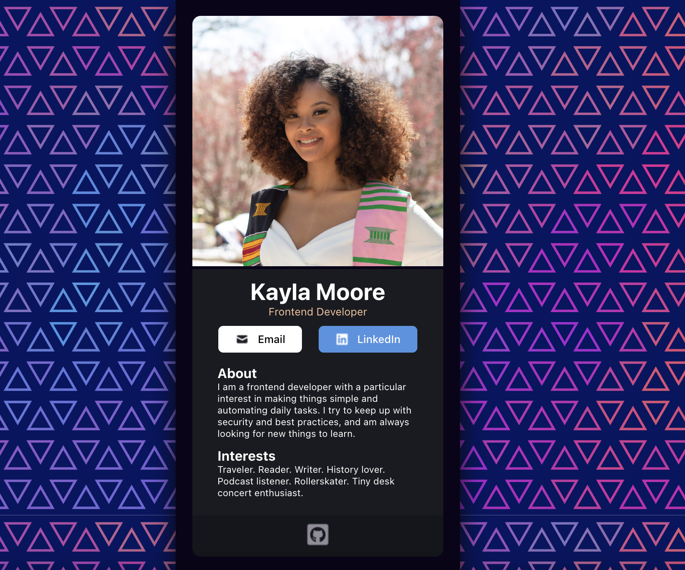

# digital-business-card

<!-- Improved compatibility of back to top link: See: https://github.com/othneildrew/Best-README-Template/pull/73 -->

<a name="readme-top"></a>

<!--
*** Thanks for checking out the Best-README-Template. If you have a suggestion
*** that would make this better, please fork the repo and create a pull request
*** or simply open an issue with the tag "enhancement".
*** Don't forget to give the project a star!
*** Thanks again! Now go create something AMAZING! :D
-->

<!-- PROJECT LOGO -->
<br />

<!-- TABLE OF CONTENTS -->
<details>
  <summary>Table of Contents</summary>
  <ol>
    <li>
      <a href="#about-the-project">About The Project</a>
      <ul>
        <li><a href="#built-with">Built With</a></li>
        <li><a href="#features">Features</a></li>
      </ul>
    </li>
    <li>
      <a href="#getting-started">Getting Started</a>
      <ul>
        <li><a href="#prerequisites">Prerequisites</a></li>
        <li><a href="#installation">Installation</a></li>
      </ul>
    </li>
    <li><a href="#usage">Usage</a></li>
    <li><a href="#acknowledgments">Acknowledgments</a></li>
  </ol>
</details>

<!-- ABOUT THE PROJECT -->

## About The Project
### [Live Site](https://kaykaym01.github.io/digital-business-card/)

<p align="center">
    
</p>

<p>
    Digital Business Card built with HTML, CSS, JavaScript, & React. Business card includes About section, Interests section, Email link, LinkedIn link, and GitHub link. <br>
    See <a href="https://www.figma.com/file/beqxONeMYVVnCUdBu9IkeA/Digital-Business-Card-(Copy)?node-id=0%3A1">Figma Design File</a> for design reference.
</p>

<p align="right">(<a href="#readme-top">back to top</a>)</p>

### Built With

[![HTML5][html-shield]][html-url]
[![CSS][css-shield]][css-url]
[![JS][js-shield]][js-url]
[![React][react.js]][react-url]

<p align="right">(<a href="#readme-top">back to top</a>)</p>

<!-- Features -->

## Features

- React
- React Components
- create-react-app

<p align="right">(<a href="#readme-top">back to top</a>)</p>

<!-- GETTING STARTED -->

## Getting Started

### Prerequisites

Install npm

- npm
  ```sh
  npm install npm@latest -g
  ```

### Installation

1. Clone the repo
   ```sh
   git clone git@github.com:kaykaym01/digital-business-card.git
   ```
2. Navigate to project directory
   ```sh
   cd digital-business-card/digital-business-card
   ```
3. Install NPM packages
   ```sh
   npm install
   ```

<p align="right">(<a href="#readme-top">back to top</a>)</p>

<!-- USAGE EXAMPLES -->

## Usage

Launch app

```sh
npm start
```

<p align="right">(<a href="#readme-top">back to top</a>)</p>


<!-- ACKNOWLEDGMENTS -->

## Acknowledgments

- [Best-README-Template](https://github.com/othneildrew/Best-README-Template)
- [Scrimba: Learn React for Free](https://scrimba.com/learn/learnreact)
- [Figma Design File](https://www.figma.com/file/beqxONeMYVVnCUdBu9IkeA/Digital-Business-Card-(Copy)?node-id=0%3A1)

<p align="right">(<a href="#readme-top">back to top</a>)</p>

[react.js]: https://img.shields.io/badge/React-20232A?style=for-the-badge&logo=react&logoColor=61DAFB
[react-url]: https://reactjs.org/
[html-shield]: https://img.shields.io/badge/HTML5-E34F26?style=for-the-badge&logo=html5&logoColor=white
[html-url]: https://www.w3.org/html/
[js-shield]: https://img.shields.io/badge/JavaScript-F7DF1E?style=for-the-badge&logo=javascript&logoColor=black
[js-url]: https://developer.mozilla.org/en-US/docs/Web/JavaScript
[css-shield]: https://img.shields.io/badge/CSS3-1572B6?style=for-the-badge&logo=css3&logoColor=white
[css-url]: https://www.w3schools.com/css/
